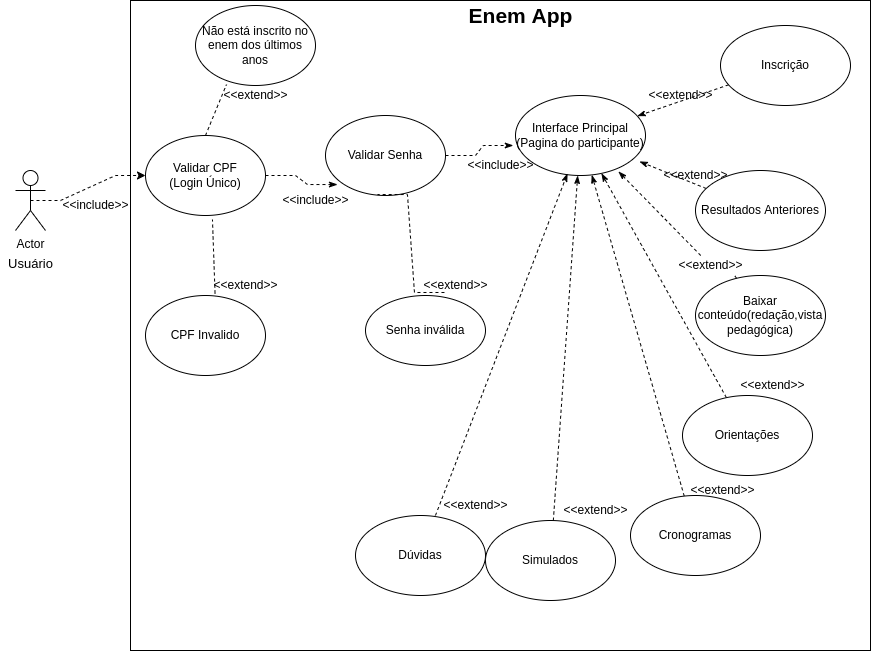
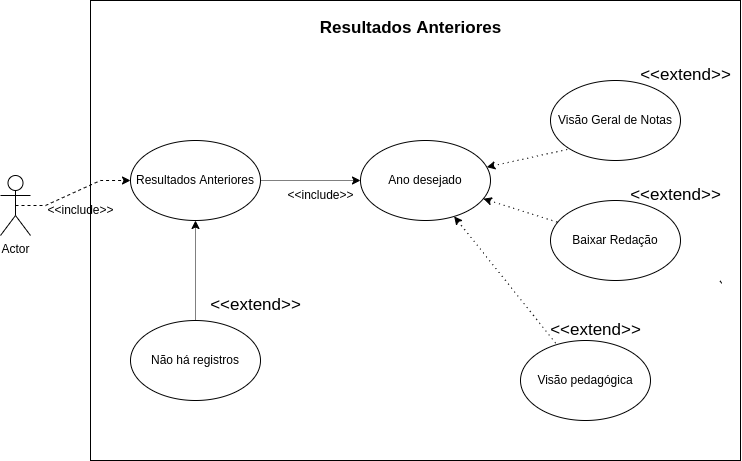

# Casos de uso

## 1. Introdução

Casos de usos são utilizados para ilustrar/descrever uma funcionalidade do sistema, através de diagramas e entidades. É como contar uma história, só que neste caso seguindo padrões, para que desenvolvedores/designers consigam ter uma abstração/persepção o mais compatível possível.

## 2. Características dos Diagramas de Casos de Uso.

#### 2.1. Atores

- Representa um conjunto de papéis que os usuários de casos de uso podem exercer.
- Representa o papel do ser humano(usuário) no sistema.

#### 2.2. Relacionamentos

- Generalização : especializado em um ou mais caso de uso
- Inclusão : incorpora o comportamento decorrente de outra ação do caso de uso.
- Estentido : Comportamento opcional(possível) do sistema

#### 2.3. Casos de Uso

- Representa as ações entre as entidads do sistema
- Representação contextual do sistema

## 3. Diagrama casos de uso

#### 3.1. Descrição do diagrama

**Login do usuário**

O Usuário informa seu CPF, ele é validado de duas formas, através do login único, CPF válido e se o usuário foi candidato do enem nos últimos anos. Depois de passar da etapa de autenticação, o usuário ver uma tela com opções do contexto como ver cronograma, simulados e notas anteriores.

#### 3.2. Objetivo

Entendimento do fluxo de acesso do usuário no aplicativo

#### 3.3. Descrição do diagrama

**Resultados Anteriores**

O Usuário acessa a aba de resultados(exames) anteriores, com o poder de escolher o ano desejado e ter acesso a visão geral de notas, redação ou visão pedagógica.

#### 3.4. Objetivo

Entendimento do fluxo de acesso do usuário no contexto de resultados de exames anteriores.

## 4. Conclusão

Os diagramas de casos de uso ajuda muito no entendimento do contexto e fluxo do usuário no sistema, traz consigo detalhes e como este fluxo pode desviar-se. Apesar de ser bem descritivo, as métodologias ágeis tem adotado cada vez mais um método alternativo como histórias de usuário por conta da agilidade e re-design.

## 5. Bibliografia

UML - Casos de Uso - Conceitos (revisão); Disponível em: <a href="http://www.macoratti.net/11/10/uml_rev1.htm">link</a>. Acesso em: 05/03/2022.

Modelo de Caso de Uso, Disponível em: <a href="https://www.cin.ufpe.br/~gta/rup-vc/core.base_rup/guidances/guidelines/use-case_generalization_B301F53B.html">link</a>. Acesso em: 05/03/2022.

Histórias de Usuário vs Casos de uso: Prós e contras para o desenvolvimento ágil, Disponível em: <a href="https://blog.cedrotech.com/historias-de-usuario-vs-casos-de-uso-pros-e-contras-para-o-desenvolvimento-agil">link</a>

Play Store, Inep - ENEM, Disponível em: <a href="https://play.google.com/store/apps/details?id=br.gov.inep.inepenem&hl=pt_BR&gl=US">link</a>. Acesso em: 05/03/2022.

## 6. Histórico de versão

| Versão | Data       | Modificação             | Autor                          |
| ------ | ---------- | ----------------------- | ------------------------------ |
| 1.0    | 04/03/2022 | Criação da página       | Antonio Rangel e Carlos Rafael |
| 2.0    | 05/03/2022 | Elaboração do documento | Antonio Rangel e Carlos Rafael |
